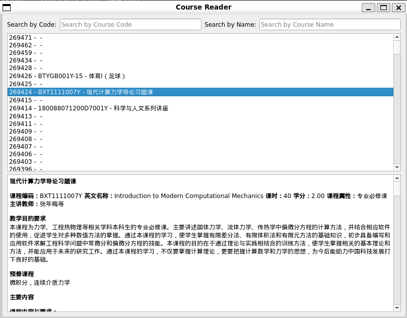

### 项目名称
SEP Course Plans Robot

### 项目简介
该项目是一个课程计划管理系统，旨在爬取并展示中国科学院大学UCAS-SEP课程系统中的课程信息。系统包括爬虫模块、数据读取模块和图形化用户界面模块，可以让用户方便地搜索和查看课程信息。

### 项目结构
```
CoursePlan Management System/
│
├── main.py            # 主程序入口
├── crawler.py         # 爬虫模块
├── reader.py          # 数据读取模块
├── viewer.py          # 图形用户界面模块
├── config.json        # 配置文件
└── data/              # 数据存储目录
└── index/              # 索引储存目录
```

### 功能介绍

#### 1. 爬虫模块 (crawler.py)
`crawler.py` 文件中定义了 `CourseCrawler` 类，负责爬取课程信息并保存到本地。主要功能包括：
- 从配置文件 `config.json` 中加载登录信息、批次大小和爬取范围。
- 使用会话登录课程系统。
- 爬取指定范围内的课程信息。
- 将爬取到的课程信息保存为 JSON 文件。

#### 2. 数据读取模块 (reader.py)
`reader.py` 文件中定义了 `CourseReader` 类，负责读取和管理爬取到的课程数据。主要功能包括：
- 构建和保存课程索引。
- 从索引文件中加载课程信息。
- 根据课程 ID 获取详细的课程信息。
- 列出所有课程的简要信息。

#### 3. 图形用户界面模块 (viewer.py)
`viewer.py` 文件中定义了 `HtmlViewer` 类，负责提供图形化用户界面以便用户搜索和查看课程信息。主要功能包括：
- 搜索框，用于根据课程编码和课程名称进行搜索。
- 课程列表，显示搜索结果。
- HTML 查看器，展示选定课程的详细信息。

### 安装与运行

#### 1. 环境依赖
- Python 3.x
- requests
- beautifulsoup4
- tqdm
- PyQt5

可以使用以下命令安装所需的 Python 库：
```bash
pip install requests beautifulsoup4 tqdm pyqt5
```

#### 2. 配置文件
在项目根目录下创建 `config.json` 文件，填写登录信息、使用模式、批次大小和爬取范围：
```json
{
  "username": "your_username",
  "password": "your_password",
  "batch_size": 200,
  "mode": "crawl" or "query",
  "start": 0,
  "end": 999999
}
```

#### 3. 运行爬虫
在命令行中运行以下命令开始爬取课程信息：
```bash
python main.py
```

### 使用说明
1. 运行主程序 `main.py`，
2. 若为`crawl`模式，程序将开始爬取课程信息，显示进度条。
3. 若为`query`模式，程序将启动图形用户界面。
4. 使用搜索框输入课程编码或名称进行搜索。
5. 在课程列表中选择一门课程，详细信息将显示在下方的 HTML 查看器中。

### 示例截图


### 贡献
欢迎对本项目提出意见或建议，您可以通过创建 Issue 或 Pull Request 的方式进行贡献。

### 许可证
本项目使用 MIT 许可证，详情请参阅 LICENSE 文件。
